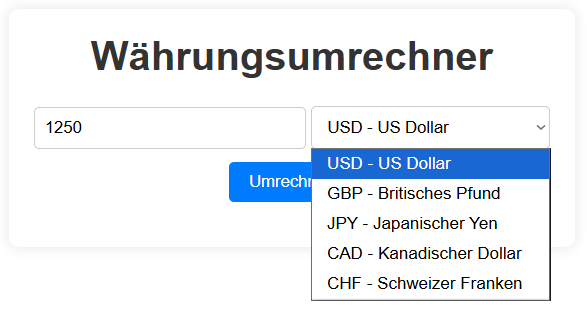

# Währungsumrechner (Browser-Extension)

Eine Chrome-Extension (Manifest V3) zur Umrechnung von EUR-Beträgen in andere Währungen, mit aktuellen Wechselkursen über die ExchangeRate-API.

## Demo

## Funktionen

- Eingabe eines EUR-Betrags und Auswahl einer Zielwährung (USD, GBP, JPY, CAD, CHF)
- Umrechnung mit **live abgerufenen, aktuellen Wechselkursen** über eine externe API
- Eingabevalidierung (leere oder ungültige Beträge werden abgefangen)
- Fehlerbehandlung, falls der Wechselkurs-Abruf fehlschlägt (z. B. kein Internet)

## Technologien

- HTML, CSS, Vanilla JavaScript
- Chrome Extension (Manifest V3)
- [ExchangeRate-API](https://www.exchangerate-api.com/) für aktuelle Wechselkurse

## Installation / Ausführen

1. Repository herunterladen bzw. klonen
2. Einen kostenlosen API-Key auf [exchangerate-api.com](https://www.exchangerate-api.com/) erstellen
3. In `umrechnung.js` den Platzhalter `DEIN_API_KEY` durch den eigenen API-Key ersetzen
4. In Chrome zu `chrome://extensions` navigieren
5. Oben rechts **"Entwicklermodus"** aktivieren
6. Auf **"Entpackte Erweiterung laden"** klicken und den Projektordner auswählen
7. Die Extension erscheint in der Symbolleiste und kann direkt genutzt werden

## Was ich dabei gelernt habe

- Aufbau einer Chrome-Extension nach Manifest V3, inklusive `host_permissions` für externe API-Zugriffe
- Asynchrone Kommunikation mit einer externen REST-API über `fetch` mit `async`/`await`
- Fehlerbehandlung bei Netzwerk-Anfragen mit `try`/`catch`
- Umstieg von fest codierten Beispielwerten auf live abgerufene, echte Daten

## Hinweis zum API-Key

Aus Sicherheitsgründen ist im Code nur ein Platzhalter (`DEIN_API_KEY`) hinterlegt. Für die eigene Nutzung muss ein kostenloser API-Key auf exchangerate-api.com erstellt und eingetragen werden.
